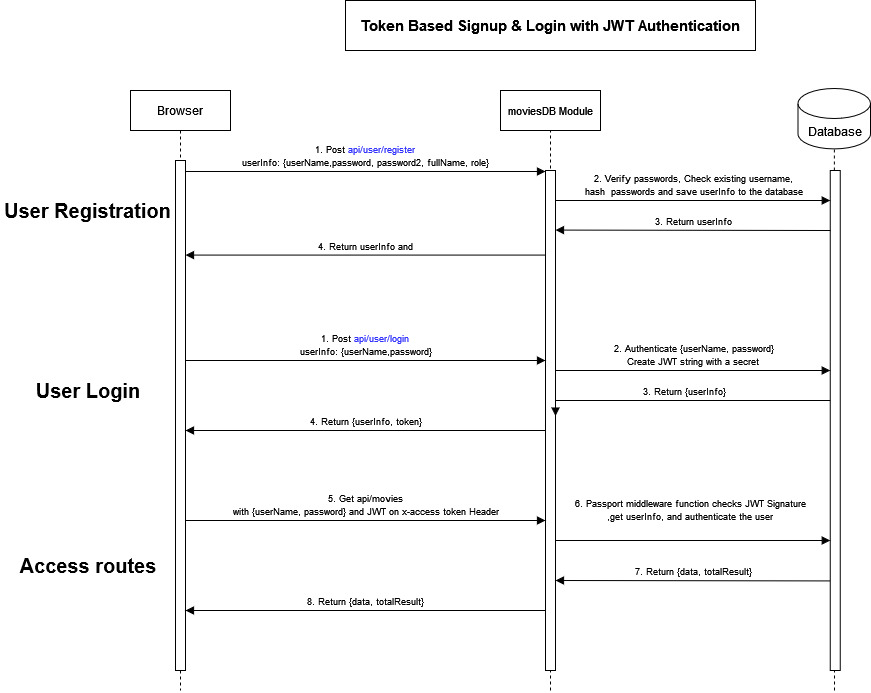

<!-- TABLE OF CONTENTS -->
<!-- <details>
  <summary>Table of Contents</summary>
  <ol>
    <li>
      <a href="#about-the-project">About The Project</a>
      <ul>
        <li><a href="#built-with">Built With</a></li>
      </ul>
    </li>
    <li>
      <a href="#getting-started">Getting Started</a>
      <ul>
        <li><a href="#prerequisites">Prerequisites</a></li>
        <li><a href="#installation">Installation</a></li>
      </ul>
    </li>
    <li><a href="#usage">Usage</a></li>
    <li><a href="#roadmap">Roadmap</a></li>
    <li><a href="#contributing">Contributing</a></li>
    <li><a href="#license">License</a></li>
    <li><a href="#contact">Contact</a></li>
    <li><a href="#acknowledgments">Acknowledgments</a></li>
  </ol>
</details> -->


<!-- ABOUT THE PROJECT -->
## About The Project
<!-- Demo: [![Product Name Screen Shot][product-screenshot]](https://example.com) --> 

### Description
**Movie Search Engine** is a full-stack movie search web application allowing users to search movies by various categories such as title, casts, and IMDB rating. It has been built using [MERN stack](https://www.mongodb.com/mern-stack).

### Motivation
Learning and skill development: Building a full-stack web application provides an opportunity to enhance programming skills, gain experience in various technologies, and understand the complexities of building a real-world application.

### Problem Solving:
The movie search web application solves the problem of finding relevant movies based on user's preferences. It offers users a centralized platform where they can search for movies by title, rating, genre, and other criteria, thereby facilitating the discovery of movies that align with their interests.

### Learnings
#### Front-end development: 
Using CSS framework of Bootstrap, React-Bootstrap, I learned how to structure and organize components, leverage Bootstrap's responsive design features, and create a visually appealing and user-friendly interface
#### Back-end development: 
I created my own server using Express.js, a popular Node.js framework, to handle the back-end logic and API endpoints. I learned how to define routes, handle requests, and establish communication between the client and the server.
#### Database management: 
With MongoDB, I learned how to work with a NoSQL database and utilize the power of MongoDB's document-oriented model. I gained experience in creating and managing collections, defining schemas, and performing CRUD operations to store and retrieve movie information and user data.

#### Challenges:
Implementing the advanced search functionality for the movie search web application was difficult since handling the dynamic query generation and search process through MongoDB required extensive research and experimentation.

Constructing dynamic queries based on various search parameters and their combinations involved meticulous consideration of different query operators, such as $gte, $lte, and $regex, to achieve the desired search results. Additionally, ensuring the search functionality was efficient and performed well with a large dataset was a significant challenge since it required careful consideration of indexing strategies.

Overcoming these challenges involved thorough testing, debugging, and refining the search functionality. In addition, leveraging online resources proved invaluable in finding effective solutions and optimizing the search functionality.


## Built With 🛠

#### Front-end Stacks
* [![Next][Next.js]][Next-url]
* [![React][React.js]][React-url]
* [![Bootstrap][Bootstrap.com]][Bootstrap-url]

#### Back-end Stacks
* [![Mongodb][Mongodb.com]][Mongodb-url]
* [![NodeJS][NodeJS.com]][NodeJS-url]
* [![ExpressJS][ExpressJS.com]][ExpressJS-url]


<!-- GETTING STARTED -->
## Getting Started

This is an example of how you may give instructions on setting up your project locally.
To get a local copy up and running follow these simple example steps.

### Prerequisites

* npm
  ```sh
  npm install npm@latest -g
  ```

### Installation
To run the Movie Search Engine application, follow the steps below to install the necessary dependencies for both the front-end and back-end components:

#### Front-end(my-app folder)
1. Navigate to the my-app folder:
   ```sh
   cd my-app
   ```
2. Install the dependencies using npm:
   ```sh
   npm install
   ```
   
#### Back-end (server folder)
1. Navigate to the server folder:
   ```sh
   npm install
   ```
2. Install the dependencies using npm:
   ```js
   npm install
   ```
#### Configuration
1. In the my-app folder, create a file named .env.local and add the following environment variables:
   ```sh
   NEXT_PUBLIC_API_URL=http://localhost:8080/api
   ```
   This sets the base URL for API requests from the front-end. Adjust the URL if your server is running on a different port or domain.
   
3. In the server folder, create a file named .env and configure the following environment variables:
   ```sh
   PORT=8080
   MONGODB_URI=<your_mongodb_uri>
   SECRET_KEY=<your_secret_key>
   ```
   Replace <your_mongodb_uri> with the connection URI for your MongoDB Atlas database. Also, generate a secure <your_secret_key> for signing JSON Web Tokens (JWT) used in authentication.

#### Running the Application
To start the Movie Search Engine application, follow these steps:
1. In the my-app folder, start the front-end development server:
   ```sh
   npm run dev
   ```
   This command starts the development server for the front-end application.
   
2. In the server folder, start the back-end server:
   ```sh
   nodemon server.js
   ```
   The server uses nodemon to automatically restart whenever changes are made to the server-side code during development.

2. Open your web browser and access the Movie Search Engine application at http://localhost:3000.
Make sure you have Node.js and npm installed on your system before running the application.

<!-- ROADMAP -->
## Roadmap
#### Front-end Features
- [x] Quick/Advanced search form implementation/validation using **[React Hook Form](https://react-hook-form.com/docs/useform)**
- [x] Track user's movie favourites/search history using **[Jotai](https://jotai.org/)** (a state management solution) 
- [x] Implement **[React Bootstrap](https://react-bootstrap.netlify.app/)** features:
    - [x] [Carousels](https://react-bootstrap.netlify.app/docs/components/carousel) for quick-searched movies under 10 results
    - [x] [Pagination](https://react-bootstrap.netlify.app/docs/components/pagination) for quick/advanced-searched movies more than 10 results
    - [x] [Cards](https://react-bootstrap.netlify.app/docs/components/cards) for displaying each movie
    - [x] [Modals](https://react-bootstrap.netlify.app/docs/components/modal) for detailed information about them selected movie
- [ ] Role-based navigation based on the user's role
    - [ ] Only admin users have access to create, update, delete movies and look up user information. 

#### Back-end Features
- [x] Server-side Routing using [Express.js](https://expressjs.com) to handle server-side routing and API endpoints
- [x] Data Storage using [MongoDB Atlas](https://www.mongodb.com/atlas) to store movie information and user data<br/>
      (The sample movie dataset provided by MongoDB Atlas was used as a starting point for the application's movie collection.)
- [x] Authentication/authorization:
    - [x]  User registration using [bcrypt](https://www.npmjs.com/package/bcrypt) to securely hash password
    - [x]  User login using [JSON Web Token (JWT)](https://jwt.io/) containing a digitally signed payload with user information
    - [x]  Protected routes using [Passport.js](https://www.passportjs.org/) to provide strategies for local authentication allowing authorized users to access protected routes
- [x] Error handling with custom error messages and status codes for different scenarios.
- [x] Advanced search Logic:
    - [x] Accept query parameters and generate search query
    - [x] Process the search query and constructs a MongoDB query to retrieve the matching movies
- [ ] Role-based access control allowing restricted APIs such as managing users and editing movie data
- [ ] Leverage simple mail transfer protocol (SMTP) using the SendGrid Email API to communicate with users
 
<!-- USAGE EXAMPLES -->
#### Authentication/Authorization Diagram


<!-- USAGE EXAMPLES -->

## Usage

1. Register a new user account and log in with an existing account.
2. Use the search bar to enter keywords and find movies.
3. Click on a movie to view its detailed information.
4. Add movies to your favourite list by clicking the "+Favourite" button.
5. Navigate to the favourite page to see your saved movies.
    Logout when you're done using the application.

<!-- CONTACT -->
## Contact

Email - songjoo29@gmail.com

LinkedIn: [https://www.linkedin.com/in/songjoo/](https://www.linkedin.com/in/songjoo/)


<!-- MARKDOWN LINKS & IMAGES -->
<!-- https://www.markdownguide.org/basic-syntax/#reference-style-links -->
[contributors-shield]: https://img.shields.io/github/contributors/othneildrew/Best-README-Template.svg?style=for-the-badge
[contributors-url]: https://github.com/othneildrew/Best-README-Template/graphs/contributors
[forks-shield]: https://img.shields.io/github/forks/othneildrew/Best-README-Template.svg?style=for-the-badge
[forks-url]: https://github.com/othneildrew/Best-README-Template/network/members
[stars-shield]: https://img.shields.io/github/stars/othneildrew/Best-README-Template.svg?style=for-the-badge
[stars-url]: https://github.com/othneildrew/Best-README-Template/stargazers
[issues-shield]: https://img.shields.io/github/issues/othneildrew/Best-README-Template.svg?style=for-the-badge
[issues-url]: https://github.com/othneildrew/Best-README-Template/issues
[license-shield]: https://img.shields.io/github/license/othneildrew/Best-README-Template.svg?style=for-the-badge
[license-url]: https://github.com/othneildrew/Best-README-Template/blob/master/LICENSE.txt
[linkedin-shield]: https://img.shields.io/badge/-LinkedIn-black.svg?style=for-the-badge&logo=linkedin&colorB=555
[linkedin-url]: https://linkedin.com/in/othneildrew
[product-screenshot]: images/screenshot.png
[Next.js]: https://img.shields.io/badge/next.js-000000?style=for-the-badge&logo=nextdotjs&logoColor=white
[Next-url]: https://nextjs.org/
[React.js]: https://img.shields.io/badge/React-20232A?style=for-the-badge&logo=react&logoColor=61DAFB
[React-url]: https://reactjs.org/
[Bootstrap.com]: https://img.shields.io/badge/Bootstrap-563D7C?style=for-the-badge&logo=bootstrap&logoColor=white
[Bootstrap-url]: https://getbootstrap.com
[Mongodb.com]: https://img.shields.io/badge/MongoDB-000000?logo=mongodb&logoColor=green
[MongoDb-url]: https://www.mongodb.com
[NodeJS.com]: https://img.shields.io/badge/NodeJS-1010?logo=nodedotjs&logoColor=%23339933&color=black
[NodeJS-url]: https://nodejs.org/en
[ExpressJS.com]: https://img.shields.io/badge/ExpressJS-1010?logo=express&logoColor=white&color=black
[ExpressJS-url]: https://expressjs.com